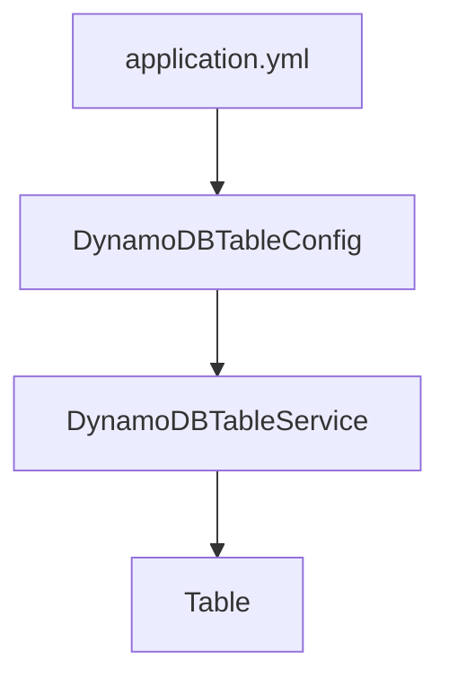

# Adding a Global Secondary Index (GSI) to [DynamoDB](https://aws.amazon.com/dynamodb/?nc2=h_ql_prod_db_ddb) using [Java](https://dev.java/) and [Dagger](https://dagger.io/)

This tutorial walks you through adding a Global Secondary Index (GSI) to a DynamoDB table using Java and Dagger for dependency injection. It will guide you through a programmatic way of creating tables, adding GSI's, and will also cover how to achieve the same setup manually using the AWS Management Console. Finally, we will touch on hot partitions, their implications on performance, and how to manage them effectively.
<br>

By the end of this guide, you will have a scalable implementation for managing DynamoDB GSIs programmatically.


## Why Use a Global Secondary Index?
<br>

A [GSI](https://docs.aws.amazon.com/amazondynamodb/latest/developerguide/GSI.html) allows querying a DynamoDB table on a different attribute than the table’s primary key. This is particularly useful when your access patterns require efficient lookups on non-primary key attributes. For example:

- Your DynamoDB table has a primary key of userId
- You need to query users based on their email

<br>
A GSI can be created with email as the partition key, enabling efficient lookups by email without scanning the entire table. The GSI can contain all of the data from the primary table, or just a selection of data. The example below shows a GSI that contains all of the attributes from the primary table, organized by a different primary key.
<br>

### Table vs GSI

| Base Table       | Partition Key | Attributes             | 
|---------|----------------|--------------------------------|
| userId  | user123        | name, email, status            | 

| GSI (EmailIndex) | Partition Key | Attributes (Projected) | 
|---------|----------------|--------------------------------|
| email   | lindsay@example.com        | name, email, status| 


## Prerequisites

- Java 17+
- AWS SDK for Java v2
- Dagger 2
- An AWS account with permissions for DynamoDB

> Ensure you have a basic understanding of Java and DynamoDB concepts before proceeding.


## Step 1: Creating a Table and GSI in the AWS Console
To understand the structure, we can manually create a table and GSI in the AWS Management Console. In the DynamoDB console, the workflow will look like:

```AWS Console > DynamoDB > Tables > Create Table > Add GSI```  


### Create a DynamoDB Table

1. Log in to the AWS Console and navigate to DynamoDB.
1. Click **Tables > Create Table**.
1. Define the table properties:
  - Table Name: Users
  - Partition Key: userId (String)
>Set the Capacity Mode to either On-demand or Provisioned based on your use case.

### Add a Global Secondary Index (GSI)

1. After creating the table, open the Indexes tab and click Create Index.
1. Define the GSI properties:
- **Index Name**: EmailIndex
- **Partition Key**: email (String)
- **Projection Type**: ALL
>Once the index is active, it will be available for queries.


### [AWS Management Console](https://console.aws.amazon.com/dynamodb/home) GSI Setup
| Step                    | Details                         | 
|-------------------------|---------------------------------|
| Define Table Schema  | Partition Key: userId              | 
| Create GSI Index Name:  | EmailIndex, Partition Key: email| 
| Projection | Type: ALL (include all attributes)           | 


## Step 2: Automating Table and GSI Creation

Now we can automate the setup using Java and Dagger instead of relying on the AWS Manangement Console. This allows for our code to be reused and provides scalable, repeatable, and automated workflows.

### Dynamic Configuration

Start by creating a application.yml configuration file to define the table and GSI properties dynamically. This allows us to avoid hardcoded values and ensures flexibility across environments. If you want to dive deeper into the table resource creation using AWS CloudFormation, see [AWS::DynamoDB::Table](https://docs.aws.amazon.com/AWSCloudFormation/latest/UserGuide/aws-resource-dynamodb-table.html).

To declare the ```AWS::DynamoDB::Table``` resource in your AWS CloudFormation template, use the following YAML syntax:

```java
dynamodb:
  table:
    name: Users
    primaryKey: userId
    gsi:
      name: EmailIndex
      partitionKey: email
      readCapacity: 5
      writeCapacity: 5
```

## Step 3: Setting Up Dependency Injection with Dagger

### DynamoDB Client Module

Use a Dagger module to provide the DynamoDB client. This ensures that a singleton [DynamoDbClient](https://sdk.amazonaws.com/java/api/latest/software/amazon/awssdk/services/dynamodb/DynamoDbClient.html) is available for injection throughout the application. Creating a new DynamoDB client for each request in your application is generally not recommended.

>Dependency injection boils down to providing an object with the objects it needs the objects (dependencies) instead of having an object construct them itself. It's a super useful technique for testing, since it allows for mocking dependencies.

```java
import dagger.Module;
import dagger.Provides;
import software.amazon.awssdk.services.dynamodb.DynamoDbClient;
import software.amazon.awssdk.regions.Region;
import javax.inject.Singleton;

@Module
public class DynamoDbModule {
    @Provides
    @Singleton

    DynamoDbClient provideDynamoDbClient() {
        return DynamoDbClient.builder()
                .region(Region.US_EAST_1) // Update the region as needed
                .build();
    }
}
```


### Step 4: Automating Table Creation

Create a service to handle the creation of the DynamoDB table dynamically:

```java
import org.springframework.stereotype.Service;
import software.amazon.awssdk.services.dynamodb.DynamoDbClient;
import software.amazon.awssdk.services.dynamodb.model.*;

@Service
public class DynamoDbTableService {
    private final DynamoDbClient dynamoDbClient;
    private final DynamoDbTableConfig config;

    public DynamoDbTableService(DynamoDbClient dynamoDbClient, DynamoDbTableConfig config) {
        this.dynamoDbClient = dynamoDbClient;
        this.config = config;
    }

    public void createTable() {
        String tableName = config.getName();
        String primaryKey = config.getPrimaryKey();

        CreateTableRequest request = CreateTableRequest.builder()
                .tableName(tableName)
                .keySchema(KeySchemaElement.builder()
                        .attributeName(primaryKey)
                        .keyType(KeyType.HASH)
                        .build())
                .attributeDefinitions(AttributeDefinition.builder()
                        .attributeName(primaryKey)
                        .attributeType(ScalarAttributeType.S)
                        .build())
                .provisionedThroughput(ProvisionedThroughput.builder()
                        .readCapacityUnits(5L)
                        .writeCapacityUnits(5L)
                       .build())
                .build();
        dynamoDbClient.createTable(request);
    }
}
```


### Execution Flow for Table Creation


>application.yml (dynamic configuration), DynamoDBTableConfig (maps config to Java), DynamoDBTableService (creates table), Table (created in AWS)
<br>


### Step 5: Automating GSI Creation

Next, create a service to automate the creation of the GSI:


```java
@Service
public class DynamoDbGsiService {
    private final DynamoDbClient dynamoDbClient;
    private final DynamoDbTableConfig config;

    public DynamoDbGsiService(DynamoDbClient dynamoDbClient, DynamoDbTableConfig config) {
        this.dynamoDbClient = dynamoDbClient;
        this.config = config;
    }

    public void createGsi() {
        GlobalSecondaryIndexUpdate gsiUpdate = GlobalSecondaryIndexUpdate.builder()
                .create(CreateGlobalSecondaryIndexAction.builder()
                        .indexName(config.getGsi().getName())
                        .keySchema(KeySchemaElement.builder()
                                .attributeName(config.getGsi().getPartitionKey())
                                .keyType(KeyType.HASH).build())
                        .projection(Projection.builder()
                                .projectionType(ProjectionType.ALL).build())
                        .provisionedThroughput(ProvisionedThroughput.builder()
                                .readCapacityUnits(config.getGsi().getReadCapacity())
                                .writeCapacityUnits(config.getGsi().getWriteCapacity()).build())
                        .build())
                .build();

        dynamoDbClient.updateTable(UpdateTableRequest.builder()
                .tableName(config.getName())
                .globalSecondaryIndexUpdates(gsiUpdate)
                .build());
    }
}
```


### Step 6: Automate Execution with [Spring](https://spring.io/projects/spring-boot)

Use Spring’s [ApplicationRunner](https://docs.spring.io/spring-boot/api/java/org/springframework/boot/ApplicationRunner.html) to automatically execute the table and GSI creation when the application starts. ApplicationRunner is an interface that allows you to execute code after the Spring application context has been initialized and before the application starts processing requests. It's useful for performing setup tasks, data loading, or executing logic at application startup.


```java
import org.springframework.boot.ApplicationRunner;
import org.springframework.context.annotation.Bean;
import org.springframework.context.annotation.Configuration;


@Configuration
public class DynamoDbInitializer {
    private final DynamoDbTableService tableService;
    private final DynamoDbGsiService gsiService;


    public DynamoDbInitializer(DynamoDbTableService tableService, DynamoDbGsiService gsiService) {
        this.tableService = tableService;
        this.gsiService = gsiService;
    }

    @Bean
    public ApplicationRunner runner() {
        return args -> {
            tableService.createTable();
            gsiService.createGsi();
        };
    }
}
```


## Hot Partitions
### What Are Hot Partitions?


DynamoDB distributes data across partitions based on the hash value of the partition key. Hot partitions can occur when a disproportionate amount of requests target the same partition in DynamoDB, leading to performance bottlenecks. When items are inserted or queried, DynamoDB uses the partition key to determine which partition stores the item. If certain partition key values are accessed more frequently, the partition becomes "hot". A hot partition is one that has been overloaded with more requests than it can handle, leading to:

- [Throttling](https://docs.aws.amazon.com/amazondynamodb/latest/developerguide/TroubleshootingThrottling-common-issues.html) - DynamoDB rejects requests that exceed a partitions Read Capacity Units (RCU) or Write Capacity Units (WCU) (tracks how much of a table's capacity is being consumed), resulting in ProvisionedThroughputExceededException.
  
  >See [Error Handling in DynamoDB](https://docs.aws.amazon.com/amazondynamodb/latest/developerguide/Programming.Errors.html)
  >See [Read consistency in DynamoDB](https://docs.aws.amazon.com/amazondynamodb/latest/developerguide/HowItWorks.ReadConsistency.html)
- Increased Latency - Requests that may not have been throttled could experience varying response times as some requests wait longer in a queue
- Wasted Capacity - Some partitions in the table might be underutilized while others are overloaded


## Wrapping Up

In this tutorial, we:

1. Set up a DynamoDB table and GSI manually in the AWS Console.
1. Automated the process using Java, Dagger, and Spring.
1. Discussed hot partitions and strategies to prevent them.
